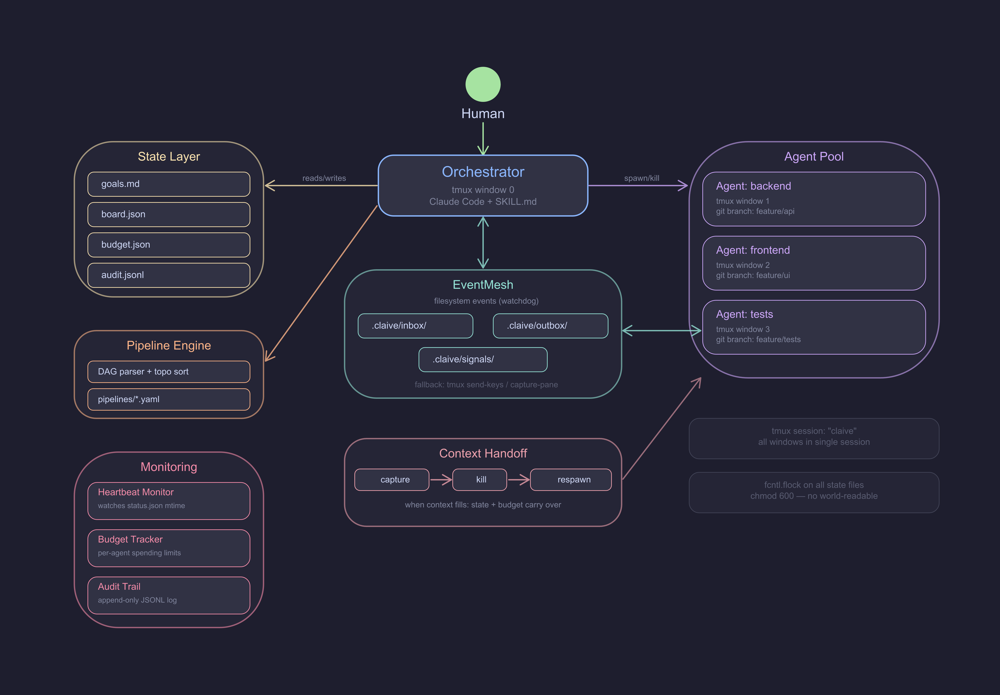

# claive

**Self-owned multi-agent orchestrator for Claude Code.**

Coordinates multiple Claude Code agents through tmux, with budget governance, audit trails, goal hierarchies, and event-driven communication. ~1300 lines of code. You own every line.

> Built on tmux + Python 3 + Bash. No servers, no databases, no dependencies you can't read in 10 minutes.

## Architecture



See [ARCHITECTURE.md](ARCHITECTURE.md) for the full design document.

## Philosophy

1. **You own every line.** No proprietary binaries, no mutable URLs. Every script is auditable and version-controlled.
2. **tmux is the only runtime dependency.** No Node.js server, no React dashboard. Just tmux + Python 3 + Bash.
3. **State is files, not databases.** Goals in markdown. Sessions in JSON. Audit logs in JSONL. All human-readable, all diffable.
4. **Security by default.** State files are `chmod 600`. No world-readable `/tmp/`. Temp files cleaned up after use.
5. **One command to do anything.** `claive spawn`, `claive read`, `claive send`, `claive kill`, `claive status`.

## Prerequisites

- [Claude Code](https://docs.anthropic.com/en/docs/claude-code) CLI installed and available in your `PATH`
- `tmux` (pre-installed on most Unix systems, or `brew install tmux` / `apt install tmux`)
- `Python 3.6+` (pre-installed on most Unix systems)
- `git` (pre-installed)

Optional:
- `watchdog` (`pip install watchdog`) — enables sub-second filesystem events, falls back to 2s polling without it
- `PyYAML` (`pip install pyyaml`) — required for DAG pipeline features

## Install

```bash
git clone https://github.com/ionutz0912/claive.git
cd claive
chmod +x bin/claive

# Add to your shell profile (~/.zshrc or ~/.bashrc):
echo 'export PATH="$HOME/claive/bin:$PATH"' >> ~/.zshrc
source ~/.zshrc

# Verify
claive help
```

## Quick Start

```bash
# Define your mission
$EDITOR state/goals.md

# Spawn your first agent
claive spawn hello --prompt "Say hello and list the files in the current directory"

# Read what it's doing
claive read hello

# Send it a follow-up
claive send hello "Now create a README.md"

# Check the audit log
python3 lib/audit.py show

# Kill it
claive kill hello
```

Or launch the full orchestrator — an interactive Claude Code session that coordinates everything:

```bash
claive start
```

Then talk to it in natural language. It reads your `state/goals.md`, decomposes work into agents, and manages them for you.

## Features

- **EventMesh** — Sub-second agent communication via filesystem events (replaces polling)
- **DAG Pipelines** — Declarative task graphs with automatic parallelism and checkpoint/resume
- **Git Branch Isolation** — Each agent works on its own branch, artifacts pass through git
- **Context Handoff** — Agents hitting context limits are seamlessly replaced with fresh continuations
- **Heartbeat Monitoring** — Detects stuck agents, auto-marks tasks as stale
- **Budget Governance** — Per-agent soft limits to prevent runaway agents (arbitrary units, not tied to billing)
- **Task Board** — Mutable operational board agents can write to during execution
- **File Locking** — Concurrent-safe state access via `fcntl.flock`
- **Audit Trail** — Append-only JSONL log of every action for full accountability

## Commands

| Command | Description |
|---------|-------------|
| `claive start` | Launch interactive orchestrator (Claude Code + SKILL.md in tmux) |
| `claive stop` | Kill session + clean up signals and checkpoints |
| `claive spawn <name> [--prompt "..."] [--branch <b>] [--budget $N]` | Spawn an agent |
| `claive list` | Show all active agents |
| `claive read <name> [--lines N]` | Read agent's terminal output + status |
| `claive send <name> "msg"` | Send message to agent |
| `claive kill <name>` | Terminate agent |
| `claive status` | Show system overview (agents, heartbeats, budgets, pipelines) |
| `claive monitor` | Watch `claive status` every 5 seconds |
| `claive plan "goal" [--budget $N]` | Generate pipeline YAML from goal description |
| `claive pipeline <file.yaml>` | Parse pipeline and print DAG layers + prompts |
| `claive run <pipeline.yaml> [--resume] [--status]` | Execute DAG pipeline (blocking) |
| `claive merge <name>` | Merge agent's git branch to current branch |
| `claive handoff <name>` | Replace context-full agent with fresh continuation |
| `claive board [add "desc" \| assign <id> <agent> \| done <id>]` | Manage shared task board |
| `claive help` | Show usage |

## Usage Examples

### Talking to the orchestrator

`claive start` launches an interactive Claude Code session that coordinates everything. You talk to it in natural language — from vague goals to specific pipelines:

**Freeform goal** (orchestrator reads your project docs and figures out the rest):
> Build the passenger-counter project at ~/projects/passenger-counter/

The orchestrator reads PLAN.md, decomposes into agents, shows you the plan, and asks for confirmation before spawning.

**Goal with hints** (you sketch the parallelism):
> Build passenger-counter. Setup first, then detectors and outputs in parallel, then wire the CLI, test it, and build the dashboard.

**Pipeline YAML** (you define exactly what each agent does):
> Run the pipeline at pipelines/my-project.yaml

**Single task** (one agent, no plan needed):
> Spawn an agent to implement the CSV export module

### Monitoring agents

```bash
claive status                     # Overview: all agents, heartbeats, budgets, pipeline progress
claive read detectors             # Last 50 lines of an agent's terminal
claive read detectors --lines 100 # More context
tmux attach -t claive:detectors   # Jump into the agent's terminal live (Ctrl-b d to detach)
```

Inside tmux, switch between agents:
```
Ctrl-b w     # Pick from window list
Ctrl-b n/p   # Next / previous agent
Ctrl-b 0     # Back to orchestrator
```

### End-to-end: plan, run, monitor, merge

```bash
# 1. Describe what you want — claive generates a pipeline YAML
claive plan "Add JWT authentication with login, register, and protected routes"

# 2. Review the generated YAML (always review before running)
cat pipelines/add-jwt-authentication-with-login-register-and-protected-routes.yaml

# 3. Start the orchestrator and tell it to run the pipeline
claive start
# Then type: "Run the pipeline at pipelines/add-jwt-auth..."

# 4. In another terminal, monitor progress
claive status

# 5. Read individual agent output
claive read backend

# 6. Nudge a stuck agent
claive send backend "Focus on the /auth/login endpoint first"

# 7. Merge completed work
claive merge backend
claive merge frontend
```

### `claive plan` examples

| Goal | What it generates |
|------|-------------------|
| `claive plan "Add user authentication"` | schema, backend + frontend (parallel), tests |
| `claive plan "Refactor database to query builder"` | audit, tests-first, migrate (linear chain) |
| `claive plan "Write API docs, setup guide, and architecture doc"` | 3 parallel writers, 1 reviewer |
| `claive plan "Add Stripe billing" --budget 20` | schema, backend, webhook-handler, frontend, tests |
| `claive plan "Fix the N+1 query in /api/orders"` | audit, fix, test (small, focused) |
| `claive plan "Migrate from REST to GraphQL"` | schema, resolvers + types (parallel), tests, docs |

### Manual orchestration (without pipelines)

```bash
# Spawn agents with specific roles
claive spawn backend --prompt "Implement the /api/orders endpoint" --budget 5 --branch feature/orders
claive spawn frontend --prompt "Build the orders list page" --budget 5 --branch feature/orders-ui

# Check on them
claive status
claive read backend
claive read frontend

# Coordinate via the task board
claive board add "API contract: GET /api/orders returns {id, items[], total, status}"
claive board assign 1 backend
claive board done 1

# Send a message when the API is ready
claive send frontend "Backend is done. API returns {id, items[], total, status} at GET /api/orders"
```

### Command matrix

| What you want to do | Command | Notes |
|---------------------|---------|-------|
| Launch orchestrator | `claive start` | Interactive Claude Code session |
| Stop everything | `claive stop` | Kills session + cleans signals/checkpoints |
| Start a multi-agent project | `claive plan "goal"` | Generates pipeline YAML |
| Preview a pipeline | `claive pipeline file.yaml` | Shows DAG layers + prompts |
| Run a pipeline | `claive run pipeline.yaml` | Blocking — prefer orchestrator |
| Resume a failed pipeline | `claive run pipeline.yaml --resume` | Skips completed tasks |
| Check pipeline progress | `claive run pipeline.yaml --status` | Shows task states |
| See everything at once | `claive status` | Agents + heartbeats + budgets + pipelines |
| Live monitoring | `claive monitor` | Refreshes every 5 seconds |
| Spawn one agent | `claive spawn name --prompt "..."` | Manual mode |
| Read agent output | `claive read name` | Last 50 lines of terminal |
| Send agent a message | `claive send name "msg"` | Types into agent's terminal |
| Kill an agent | `claive kill name` | Removes tmux window |
| Merge agent's branch | `claive merge name` | Git merge to current branch |
| Replace context-full agent | `claive handoff name` | Captures state, kills, respawns |
| Manage tasks | `claive board [add\|assign\|done]` | Shared task board |

See `pipelines/examples/` for complete pipeline YAML examples:
- `feature-auth.yaml` — parallel backend + frontend with dependency chain
- `refactor-db.yaml` — safety-first linear migration
- `docs-sprint.yaml` — maximum parallelism fan-out pattern

## Project Structure

```
bin/claive              — CLI entrypoint (Bash dispatcher)
lib/spawn.sh            — Agent lifecycle: spawn, kill, merge
lib/comms.sh            — Read agent output + send messages
lib/lock.py             — File locking (fcntl.flock)
lib/budget.py           — Per-agent budget governance
lib/audit.py            — Append-only JSONL audit trail
lib/dag.py              — DAG pipeline parser + scheduler + task board
lib/mesh.py             — EventMesh filesystem watcher
lib/heartbeat.py        — Agent liveness monitoring
lib/handoff.py          — Context handoff (capture, kill, respawn)
hooks/session-tracker.py — Claude Code hook for session mapping
state/goals.md          — Mission + project hierarchy (you edit this)
pipelines/              — Your pipeline YAML files
pipelines/examples/     — Reference pipeline patterns
templates/solo-dev.yaml — Pre-built 4-agent team configuration
context/                — Design decisions and protocol docs
SKILL.md                — Orchestrator brain prompt
ARCHITECTURE.md         — Full design document
```

## Security

claive runs Claude Code agents that execute real commands on your machine. You should understand the trust model before using it.

### Trust model

```
You (human) → Orchestrator (Claude Code + SKILL.md) → Worker agents (Claude Code)
```

All agents run under **your user account** in a shared tmux session. An agent can do anything you can do. This is by design — agents need filesystem and git access to do real work.

`claive start` launches the orchestrator with `--dangerously-skip-permissions`, which disables Claude Code's interactive permission prompts. Without this, the orchestrator can't spawn or coordinate agents autonomously. **This means agents will execute commands without asking you first.**

### What's hardened

- **No network dependencies.** No remote script fetching, no package downloads at runtime, no phoning home. Everything runs locally.
- **No secrets handling.** claive never reads, stores, or transmits API keys or credentials. Don't put secrets in agent prompts.
- **File permissions.** State files (`budget.json`, `audit.jsonl`, `board.json`) are `chmod 600`. Session directories are `chmod 700`.
- **Concurrent-safe state.** All state file access uses `fcntl.flock` to prevent corruption from parallel agents.
- **Append-only audit.** Every spawn, kill, send, read, merge, and handoff is logged to `state/audit.jsonl`.
- **No dependencies you can't read.** The entire codebase is ~1300 lines. `watchdog` and `pyyaml` are optional.

### Known limitations

- Agents share a tmux session — one agent could `tmux capture-pane` another agent's terminal. Use separate tmux sockets if you need strict isolation.
- Prompts are visible in tmux pane buffers. Don't include passwords or tokens in agent prompts.
- A compromised agent runs as your user and could modify claive's own scripts.
- No encryption at rest — state files rely on Unix file permissions, not cryptography.
- Budget limits are advisory, not enforced by billing. An agent can't spend real money, but it can ignore its soft cap.

### Audit it yourself

That's the point. At ~1300 lines across 10 files, you can read the entire codebase in under an hour. Start with `bin/claive` (200 lines) and `lib/spawn.sh` (137 lines) — that's the core. See `context/security-model.md` for the full threat model.

## Contributing

1. Fork the repository
2. Create a feature branch (`git checkout -b feature/my-feature`)
3. Keep changes minimal — the codebase is intentionally small (~1300 lines)
4. Follow existing patterns: Bash for CLI + shell glue, Python for logic + state
5. Submit a pull request

Please read [ARCHITECTURE.md](ARCHITECTURE.md) before proposing structural changes.

## Author

Built by [@ionutz0914](https://x.com/ionutz0914)

## License

MIT
